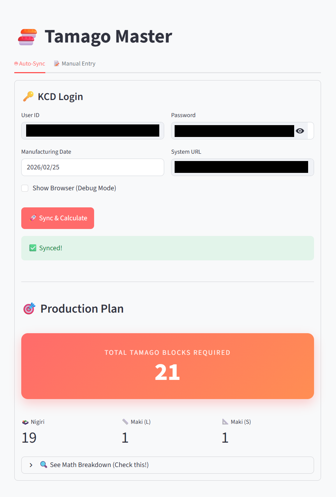
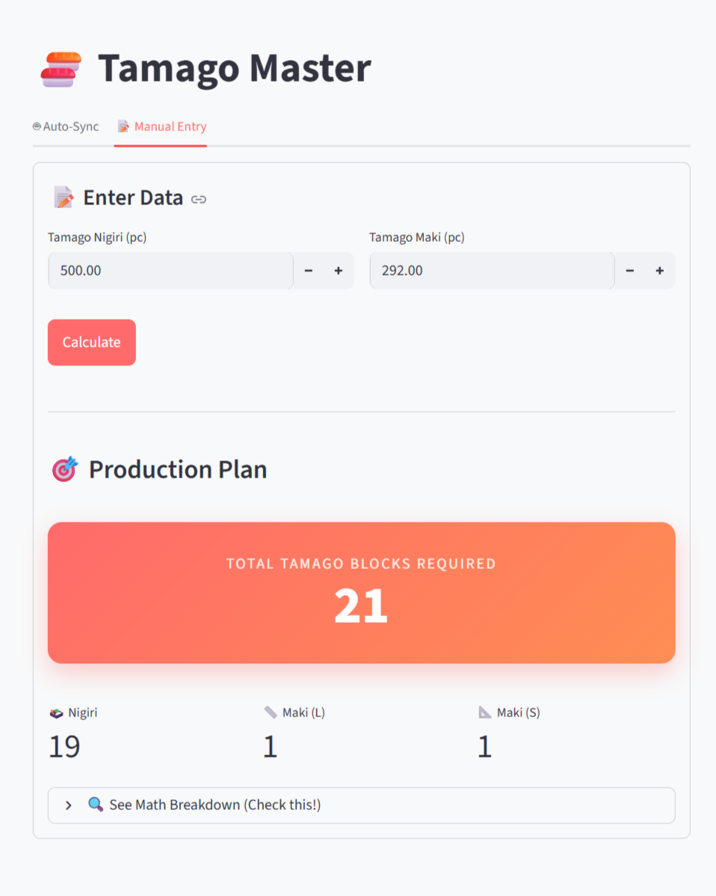
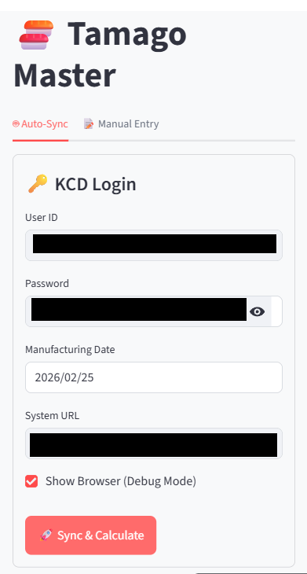

# 🏭 Automated Production Calculator (Project: Tamago Master)

*Note: For confidentiality and data privacy reasons, specific company names and internal system URLs have been sanitized or redacted from this public repository.*

## 📖 Business Problem & Project Overview
Before this tool was developed, the daily production planning at a manufacturing facility was a highly manual and error-prone process. Every day, floor managers had to manually log into an internal inventory system, extract specific daily usage numbers, and calculate the required production blocks for the day using paper and pencil. 

**The Solution:** I developed an automated, mobile-responsive web application that handles the entire workflow. The tool uses Selenium to securely authenticate into the company's internal portal, scrapes the required ingredient data, runs the complex 5-step production algorithm, and outputs the exact manufacturing requirements instantly.

## 📸 Application Interface
The tool was built with a clean, mobile-responsive UI using Streamlit, deployed internally under the project name **Tamago Master**.

**Automated Sync Dashboard** *Secure login interface that triggers the headless Selenium scraper to fetch daily targets.*

**Manual Fallback Mode** *A built-in calculator to ensure production planning can continue even if the target database structure changes or goes offline.*

**Mobile-Optimized UI** *Designed specifically for floor managers to operate easily from their mobile devices while on the active factory floor.*

## 🎯 My Role & Technical Focus
This project was developed as a **Proof of Concept (PoC)** to demonstrate how operational bottlenecks can be solved through automation. 

My core responsibilities included:
1. **Requirements Gathering:** Shadowing the end-user to understand the manual workflow and translating their paper-and-pencil math into strict algorithmic logic.
2. **DOM Traversal & Web Scraping:** While I utilized AI to assist with the application's boilerplate, my primary engineering focus was on the data extraction layer. I manually inspected the internal system's HTML structure and tuned the Selenium locators (XPath and CSS Selectors) to ensure the script reliably grabbed the correct dynamic data points.
3. **UI/UX Implementation:** Deployed the tool using Streamlit to create a clean, high-contrast interface that non-technical users could easily operate.

## 🛠️ Tech Stack & Architecture
* **Frontend:** Streamlit (Python) for rapid, mobile-friendly UI deployment.
* **Data Extraction Layer:** Selenium WebDriver & BeautifulSoup4 for headless browser automation and HTML parsing.
* **Logic Layer:** Python-based 5-step custom rounding algorithm to calculate exact physical production yields.

## 🧠 Key Learnings
This project taught me the realities of building software for non-technical users. I learned how brittle web scrapers can be when internal company systems update their UI, which reinforced my skills in reading DOM structures and writing resilient CSS selectors. It also highlighted the importance of always building a "fallback" manual mode to ensure continuous business operations.
